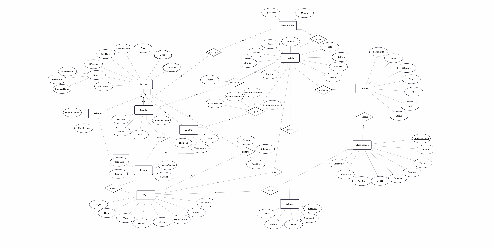

# Documentação

Esta pasta contém a documentação técnica e diagramas do sistema.

## 📁 Arquivos

### `DER.png`
Diagrama Entidade-Relacionamento do sistema.
- Mostra entidades e relacionamentos
- Cardinalidades e atributos
- Visão conceitual do banco

### `DiagramaRelacional.png`
Diagrama do modelo relacional implementado.
- Tabelas com chaves primárias e estrangeiras
- Estrutura física do banco de dados
- Constraints e tipos de dados

### `DiagramaRelacional.pgerd`
Arquivo fonte do diagrama relacional (pgModeler).
- Arquivo editável do modelo
- Permite modificações e atualizações
- Formato nativo do pgModeler

### `RelatórioTécnico-GabrielBressane.pdf`
Relatório técnico completo do projeto.
- Análise de requisitos
- Modelagem conceitual e lógica
- Implementação e testes
- Conclusões e melhorias futuras

## 🔍 Como Visualizar

- **Diagramas PNG**: Abrir diretamente no navegador ou visualizador de imagens
- **Arquivo .pgerd**: Abrir com pgModeler
- **PDF**: Visualizar com qualquer leitor de PDF